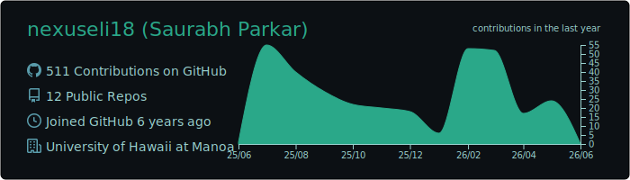
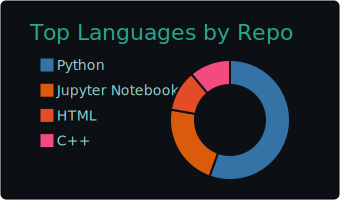
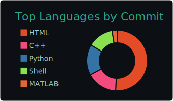
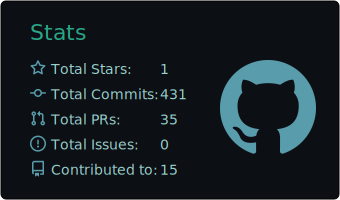

<!--
**nexuseli18/saurabhpark** is a ✨ _special_ ✨ repository because its `README.md` (this file) appears on your GitHub profile.

Here are some ideas to get you started:

- 👯 I’m looking to collaborate on 
- 🤔 I’m looking for help with ...
- 💬 Ask me about ...
- 📫 How to reach me: ...
- 😄 Pronouns: ...
- ⚡ Fun fact: ...
-->
<h1 align="center">Hi 👋, I'm Saurabh Parkar</h1>
Ph.D. student at [University of Hawaiʻi at Mānoa](https://ece.hawaii.edu/home/) researching next-generation wireless systems. My work focuses on O-RAN, ISAC, and network security, with an emphasis on intelligent, secure 6G/Next-G systems built and evaluated using real-world SDR testbeds.

- 🔭 I’m currently working on [***Fake Base Stations in 5G***](https://github.com/WINGS-UHM/Fake-Base-Station)
- 🌱 I’m currently learning **Next-G Communication Systems & AI-RAN**

## 🌐 Socials
 

## 📊 GitHub Stats:

 

## 💻 Tech Stack:
 
 
 

---

---

 
 
 
 
 
---
 
 
 
 
  
 
 
 
---

 
 
 
 

